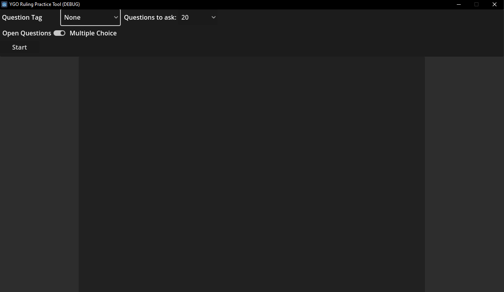
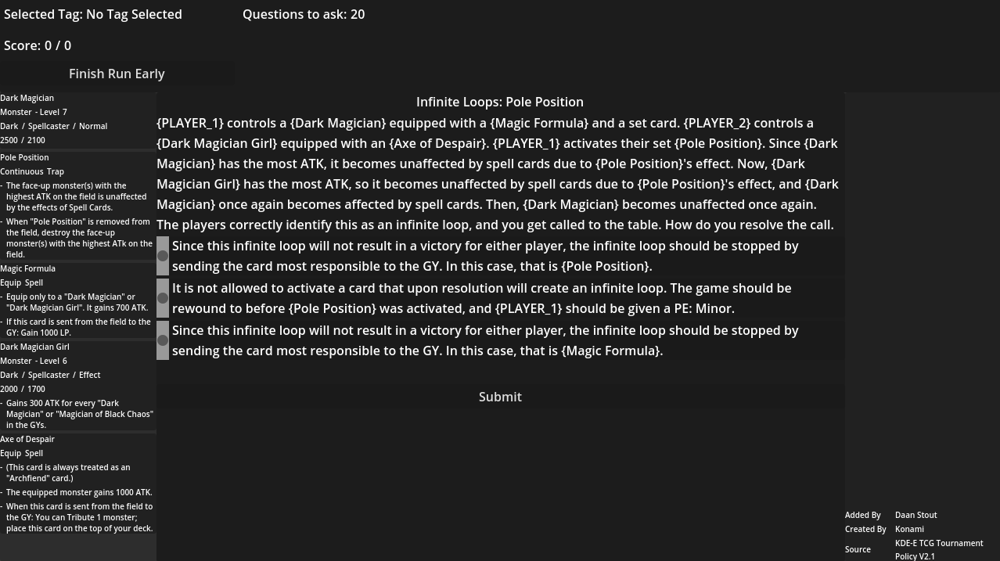
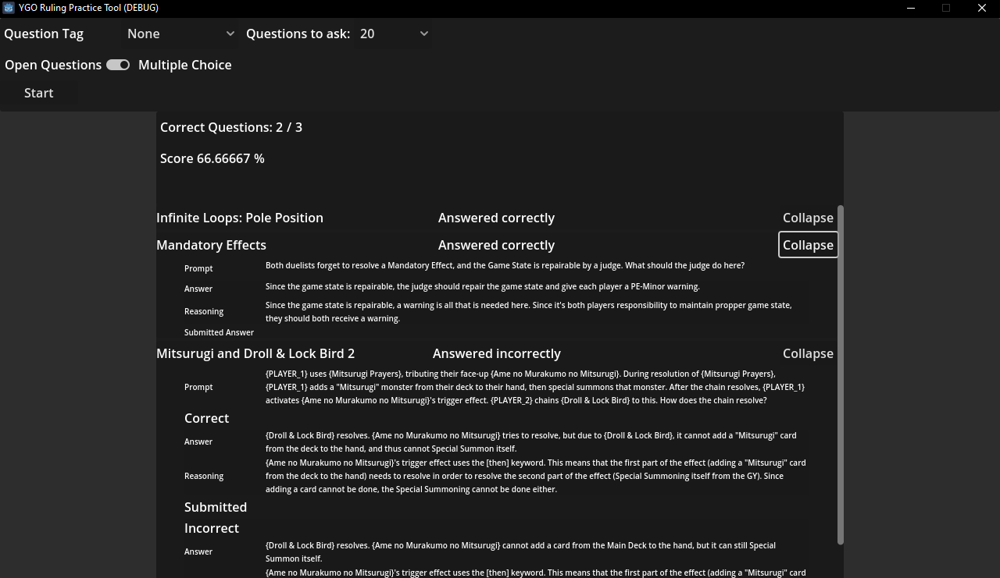

# YGO-Ruling-Practice-Tool

This is a tool I made to practice Yu-Gi-Oh rulings with. It is currently still a work in progress, but it is functional in its current state.

## The App

When you start the app, you will be able to set some settings, such as the type of questions you want to be asked and how many, and start a run.

When a run is started, you will be shown a question, with the cards relevant to the question on the left. This allows you to read the cards and come to the right solution. The answer can then be either chosen from a list of possible answers, or entered as a custom answer, depending on whether the questions are open or multiple choice.

When a run is completed, an overview of the questions that have been asked will be shown, where the user can review the questions again.

## Options before starting a run

Before starting your run, you can choose some variables that determine the questions that are asked, and how they can be answered.

### Question Tag

Questions can be given tags that tell the app what they try to test for. Using these, you can choose to either practice certain things by selecting that tag, or by selecting `None` to get any question, regardless of the tags it may have.

### Questions to Ask

With the Questions to ask field, you can choose how many questions to ask. You can choose either a certain amount, or choose `Endless` to keep getting new questions until either you manually finish the run, or until there are no more unanswered questions.

Keep in mind that if there are less questions available than you set to be asked, the run will simply stop after the last available question.

### Open Questions and Multiple Choice

Here, you can decide between having to answer the questions by writing and submitting an answer yourself, or by choosing from multiple options.

If Open Questions are selected, the app will treat every question as correct, and the run will have to be verified by someone else. A run can be saved by clicking the `Export Last Run` button that is visible after a run is completed. This saves the run to the `History` folder at the root of the application.

If Multiple choice is selected, the app will show multiple answers to the user, who has to choose which answers are correct. If multiple answers can be true, the answers will be checkboxes. if only 1 answer is correct, the answers will be radio buttons. When multiple answers are possible, all correct answers must be chosen together with none of the incorrect answers for the question to be considered correct.

## Saving Runs

A run can be saved to the `History` folder sitting at the root of the application. This folder will only appear after a run has been exported, so it will not be visible immediately. A run can be exported either by clicking the `Export Last Run` button, or by starting a new run after completing a previous one.

## Running the Practice Tool

Running the practice tool can be done by simply downloading the zip file and unpacking it.

Alternatively, you can also download the .Net version of [Godot](https://godotengine.org/download/windows/), download the source code from here (this is also included in the release, but not within the actual zip file), and open the folder with Godot. Then, you should be able to run the program by pressing the play button in the top right. You might need to download the [.Net 9 SDK](https://dotnet.microsoft.com/en-us/download/dotnet/9.0) to be able to run it.
